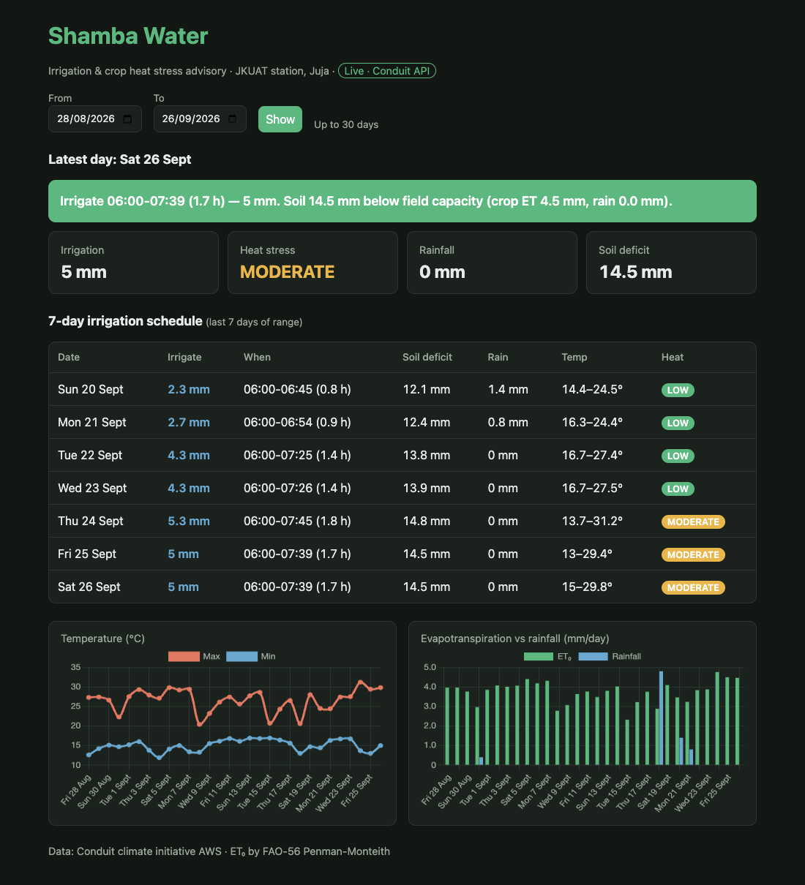
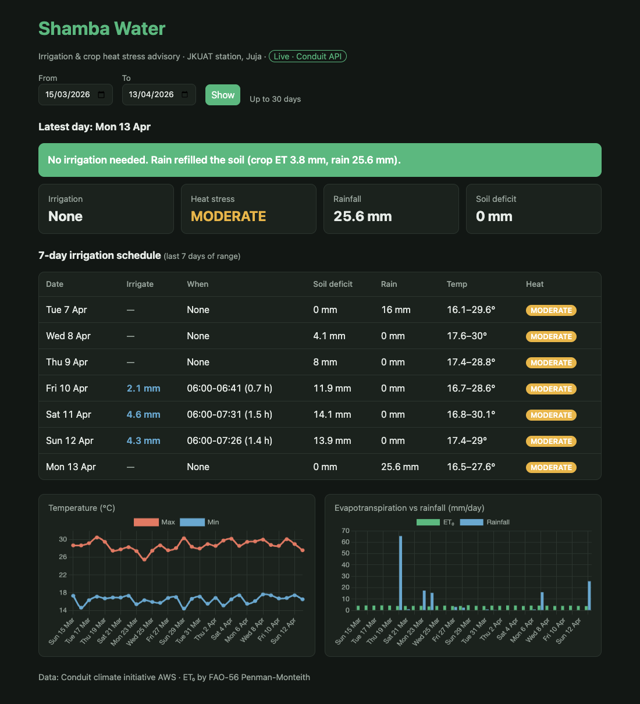
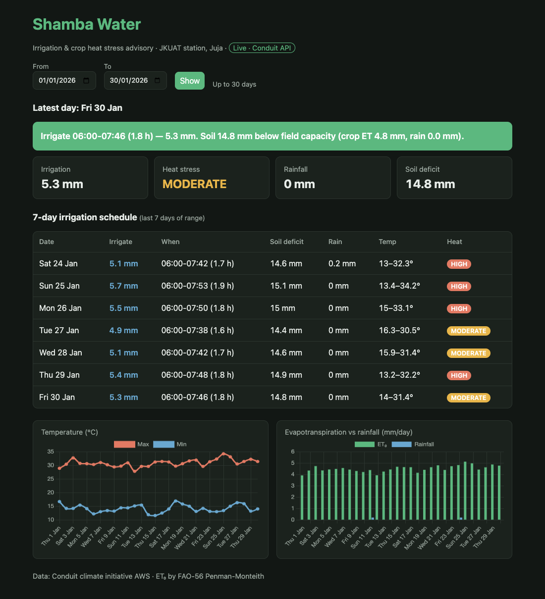
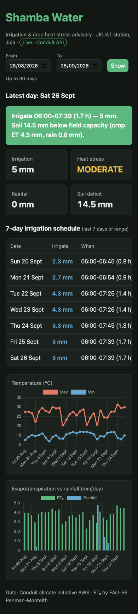

# Shamba Water: Smart Irrigation & Crop Heat Stress Advisory

Built for **Hack The Weather @ JKUAT**. 

Turns the Conduit climate initiative's JKUAT weather station readings into daily farm advice, for example *"Irrigate 06:00–07:29 (1.5 h), 4.5 mm: water deficit 4.0 mm"*,
plus crop heat stress alerts.



| Long rains (Mar–Apr 2026): stored rain postpones irrigation | Hot spell (Jan 2026): HIGH heat alerts | Mobile |
|---|---|---|
|  |  |  |

Screenshots taken on 28 Sep 2026 with live Conduit data. Any view can be linked as `/?start=2026-03-15&end=2026-04-13`.

## Quick start

```bash
uv venv && uv pip install -r requirements.txt   # or: python -m venv .venv && pip install -r requirements.txt
cp .env.example .env    # add CONDUIT_API_KEY + CONDUIT_EMAIL for live data (optional)
.venv/bin/uvicorn api.main:app --reload
```

Open http://localhost:8000 for the dashboard and http://localhost:8000/docs for interactive API docs.

```bash
.venv/bin/python -m src.data_processor      # writes Data/processed_weather.csv
.venv/bin/python -m src.irrigation_advisor  # prints the 7-day schedule
.venv/bin/python -m pytest                  # 34 tests; runs against the CSV, never the live API
```

## How it works

```
Conduit API (live) or Data/weatherdata.csv (fallback); 15-min readings, UTC
  → src/data_processor.py   convert to Nairobi time, aggregate to days, drop days <80% coverage,
                            FAO-56 Penman-Monteith ET₀, water deficit, heat stress level
  → src/irrigation_advisor.py  crop water need, irrigation amount/duration, heat mitigation
  → api/main.py             FastAPI; also serves frontend/
  → frontend/               dashboard (vanilla JS + Chart.js)
```

**Data source.** On startup the API tries the Conduit API with the key in `.env`. If there is no key
or the request fails (for example, once the key expires after the hackathon), it serves the offline
archive `Data/conduit_archive.csv` instead: the full station history from 1 Jun 2025 to 26 Sep 2026,
about 46,700 readings. The dashboard badge shows which source is in use. Restart the server to re-check.
To refresh the archive while the key still works:

```bash
.venv/bin/python -m src.data_processor --archive 2025-06-01 2026-09-26   # one API request per month
```

`Data/weatherdata.csv` is the original hackathon sample (28 Aug to 15 Sep 2026). The tests use it.

**Date range.** Users pick up to 30 days (the API returns at most about a month per request). The
newest selectable day is today minus 2, so the last day is always complete (the API lags by up to a
day). Local day D begins at 21:00 UTC on D−1, so one extra UTC day is fetched and trimmed. Results are
cached in memory; a fresh 30-day fetch takes roughly 3 to 8 s.

**Evapotranspiration.** Reference ET₀ uses FAO-56 Penman-Monteith with the station's temperature,
humidity, wind and pressure. The station's UV/solar sensor reads 0 throughout, so solar radiation is
estimated from the daily temperature range (FAO-56 eq. 50, kRs = 0.16).

**Rainfall.** `rg1tt` is a cumulative tipping-bucket total that resets daily, so daily rain is the sum
of its positive increments. `rg2tt` is non-zero every day and moves up and down, so it is not
accumulated rain and is ignored. The dataset's only real rain was 0.4 mm on 31 Aug 2026.

**Irrigation: soil water balance that leaves room for rain** (FAO-56 ch. 8). The advisor tracks how
many mm the root zone is below field capacity, carrying the value from day to day:

```
soil deficit = yesterday's deficit + Kc × ET₀ − rain      (floored at 0; excess rain drains)
irrigate     = soil deficit − 10 mm                        (if ≥ 1 mm), ÷ system efficiency
```

The soil is topped up to 10 mm *short* of full rather than to full, so the next rain is stored
instead of draining. After 16 mm of rain on 7 Apr 2026, 8–9 Apr need no irrigation. Across the
16-month archive this recommends 13% less water than refilling each day's deficit on its own. The
10 mm buffer stays below the ~18 mm a shallow-rooted crop can lose before stress sets in.

Because the deficit is pinned between 0 and the buffer, the simulation quickly forgets where it
started. The API simulates 10 days before the requested range, and on all 473 archive days checked
this gives the same advice as simulating the full history. So a day's advice doesn't depend on which
range it was requested with.

Irrigation starts at 06:00 (less evaporation, and leaves dry by evening, which cuts fungal risk).
Duration = amount / application rate. Confidence is the share of the day's expected sensor readings
actually present.

**Heat stress.** HIGH if Tmax ≥ 32 °C or WBGT ≥ 26 °C; MODERATE if Tmax ≥ 28 °C or WBGT ≥ 22 °C.
Thresholds are at the top of `src/data_processor.py`.

## Configuration

Copy `.env.example` to `.env`. It is read on startup, and variables already set in the environment take precedence.

| Variable | Default | Meaning |
|---|---|---|
| `CONDUIT_API_KEY` | – | Conduit API key; blank = CSV mode |
| `CONDUIT_EMAIL` | – | Email registered with the key |
| `WEATHER_CSV` | `Data/weatherdata.csv` | Fallback sensor export |
| `CROP_KC` | `1.0` | Crop coefficient (maize mid-season ≈ 1.2) |
| `APPLICATION_RATE_MM_H` | `3.0` | Irrigation system output |
| `IRRIGATION_EFFICIENCY` | `0.9` | Drip ≈ 0.9, sprinkler ≈ 0.75 |
| `RAIN_BUFFER_MM` | `10` | Room left in the soil for rain |

## Limitations and next steps

- **"7-day forecast" shows the 7 observed days ending on the selected end date.** For real look-ahead, feed a forecast
  (for example Open-Meteo) through the same `process()`/`IrrigationAdvisor`.
- The soil water balance starts from an assumed state, not a measured one. A soil moisture sensor
  reading could replace the warm-up. The buffer should be tuned to the real soil and root depth.
- Solar radiation is estimated because the UV sensor is dead. A working pyranometer would improve ET₀.

See [API_DOCS.md](API_DOCS.md) for endpoint details.
